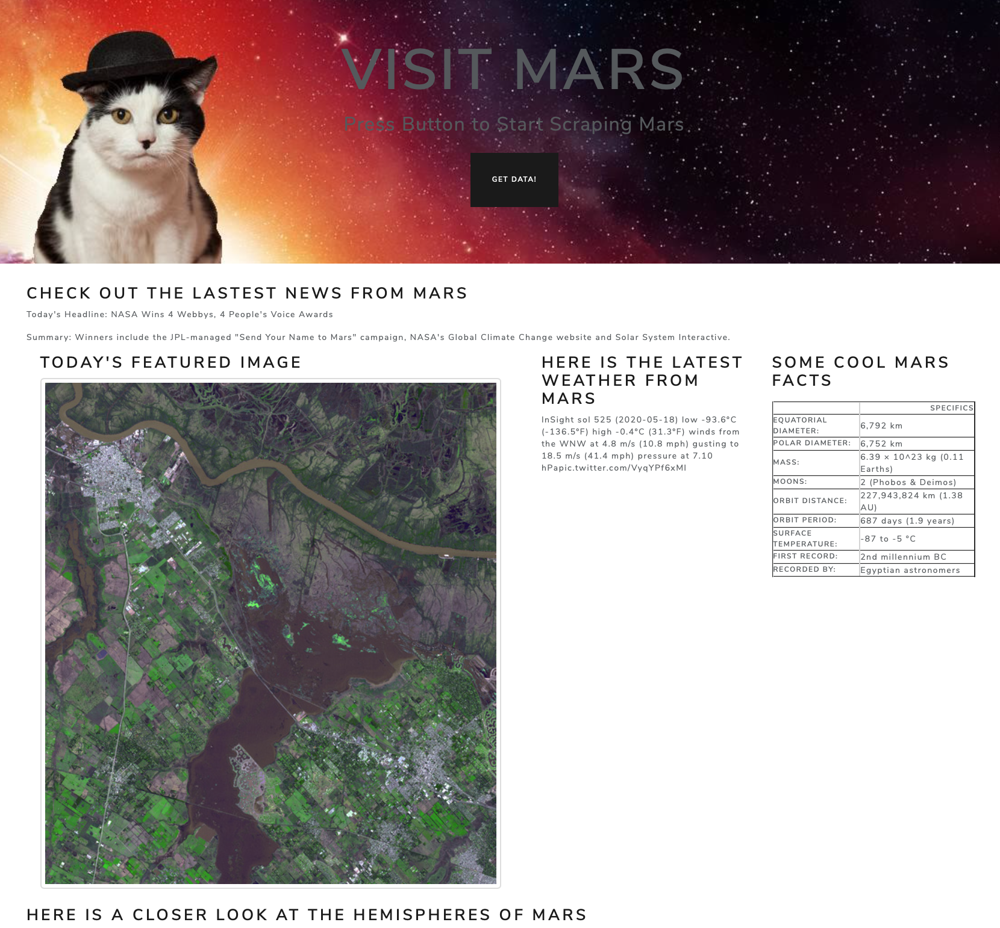
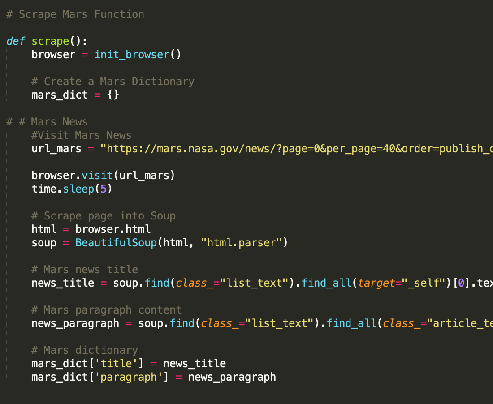

# Web Scraping Challenge

## Summary: 
In this challenge I build a web application that scrapes various websites for data related to the Mission to Mars and displays the information in a single HTML page. It gathers the lastest news from Mars each time you run the app. 

## To run the code:
* Get all the files from the repository 
* Run Mongo in your terminal.
* In a new terminal window, open the directory folder
* Run the command "python scrape_mars.py" to get all the scraping get set up into Mongo
* Run the command "python app.py" 
* Open "http://localhost:5000/" in your browser
* To get the latest news, "Get Data!" on the web page. 

## Skills Displayed: 
* Creating and connecting to local MongoDB databases
* Creating simple Python applications that connect to and modify MongoDB databases using the PyMongo library
* Using Beautiful Soup to scrape their own data from the web
* Saving the results of web scraping into MongoDB
* Rendering templates with Flask using data retrieved from a Mongo database
* Using Beautiful Soup to scrape data
* Using Flask to render templates

## Scraping Sources
### NASA Mars news 
* Scrapes the NASA Mars News Site and collects the latest News Title and Paragraph Text. 

### JPL Mars Space Images - Featured Image
* Uses splinter to navigate the space image site and finds the image url for the current Featured Mars Image.

### Mars Weather
* Visits the Mars Weather twitter account here and scrapes the latest Mars weather tweet from the page.

### Mars Facts
* Visits the Mars Facts webpage and uses Pandas to scrape the table containing facts about the planet including Diameter, Mass, etc.
* Uses Pandas to convert the data to a HTML table string.

### Mars Hemispheres
* Visits the USGS Astrogeology site here to obtain high resolution images for each of Mar's hemispheres.
* Appends the dictionary with the image url string and the hemisphere title to a list. 

## MongoDB and Flask Application
Uses MongoDB with Flask templating to create a new HTML page that displays all of the information that was scraped from the URLs above.

